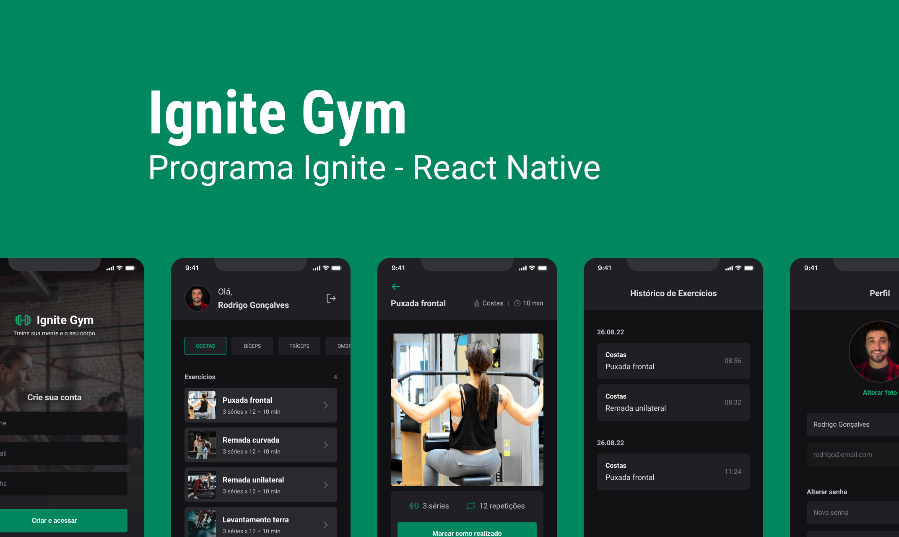
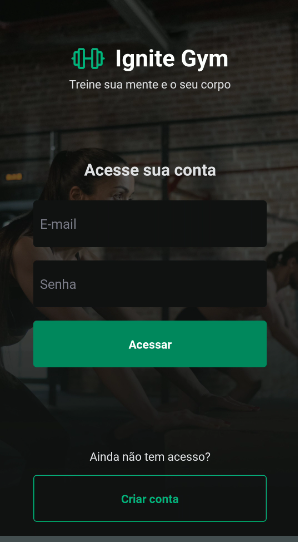
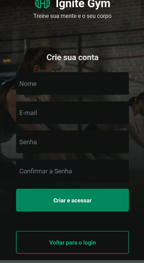
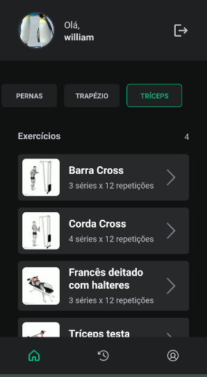
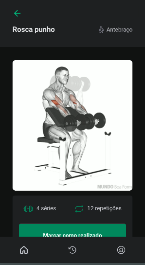
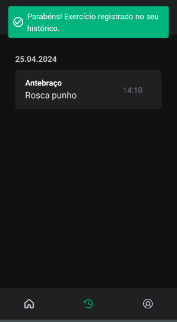
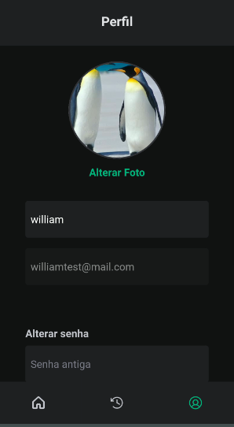

<h1 align="center">Projeto - React Native: App Trainer GYM</h1>

<p align="center">
  

  

  
  
  <a href="https://github.com/williamjayjay/Github-Blog/commits/master">
    
  </a>
    
   <a href="https://github.com/williamjayjay/appTrainerGym/stargazers">
    
  </a>
</p>

<p align="center">Vamos construir um aplicativo ao qual a principal feature é proteger dados em tela com refresh token assim mantendo a camada de segurança mais estável na aplicação, contudo também teremos formulário para login, cadastro e alteração de senha assim como foto de perfil também, e por fim utilizaremos bastante don context api. </p>

<p align="center">

</p>

## 🥶 Sobre o projeto

Desenvolvi esse projeto para reforçar meu conhecimento principalmente com login e registro autenticado e rotas protegidas por token de sessão e refresh token e também context api


## Mobile React Native:

**Aplicativo:** O app irá registrar os treinos feitos em um ambiente de academia.


## 🚀 Tecnologias

Principais tecnologias que utilizei para desenvolver esta aplicação

- [Typescript](https://www.typescriptlang.org/)
- [Async-Storage](https://docs.expo.dev/versions/latest/sdk/async-storage/)
- [React-Navigation](https://reactnavigation.org/)
- [Expo-File-System](https://docs.expo.dev/versions/latest/sdk/filesystem/)
- [Expo-Font](https://docs.expo.dev/versions/latest/sdk/font/)
- [Expo-Image-Picker](https://docs.expo.dev/versions/latest/sdk/imagepicker/)
- [Native-Base](https://nativebase.io/)
- [React-Hook-Form](https://react-hook-form.com/)
- [React-Native-Safe-Area-Context](https://docs.expo.dev/versions/latest/sdk/safe-area-context/)
- [React-Native-Toast-Message](https://www.npmjs.com/package/react-native-toast-message)
- [React-Native-SVG](https://docs.expo.dev/versions/latest/sdk/svg/)
- [Yup](https://www.npmjs.com/package/yup)

## Guia de inicialização

Para instalar e configurar uma cópia local, siga estas etapas simples:

### Prerequisitos

Para garantir o funcionamento adequado da nossa aplicação, verifique abaixo:


1. **Clone o repositório de terceiros que contém a api pronta para poder testar o app**: Neste link: [API-Terceiros](https://github.com/rocketseat-education/ignite-rn-04-ignite-gym)

2. **Clone o repositório**:
  ```sh
  git clone https://github.com/williamjayjay/appTrainerGym
  ```

3. **Navegue na raiz do projeto appTrainerGym:**

4. **Instale os módulos:**
  ```sh
  bun i
  ```

5. **Copie o .env de exemplo:** 

6. **Rode o aplicativo:**
  ```sh
  bun android
  ```

## Roadmap

- [x] Iniciar o aplicativo, conseguir fazer cadastro e login

- [x] No cadastro seguir as regras de email e senha(6 digitos) e senhas iguais.

- [x] No login fazer validação

- [x] Conseguir visualizar os treinos a serem marcados

- [x] Conseguir finalizar um treino

- [x] Conseguir ver treino finalizado na aba de histórico

- [x] Conseguir alterar foto de perfil

- [x] Conseguir alterar senha

- [x] Ser feita a validação do refresh token baseado no tempo de expiração da api a seguir 


<!-- --------------------- -->
## UI UX
UI e UX feita pelo time de design do treinamento do curso da rocketseat.

-Link para vídeo da aplicação [Video-React-Native](https://vimeo.com/939102881)

| Tela de login | Tela de cadastro |
|:-------------------------:|:-------------------------:|
|  |  |

| Tela de home | Tela de treinos |
|:-------------------------:|:-------------------------:|
|  |  |

| Tela de histórico | Tela de perfil |
|:-------------------------:|:-------------------------:|
|  |  |

